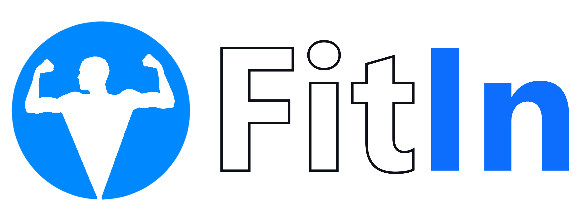

<br />
<div align="center">
  <a href="https://github.com/seyon123/cps714-g6" style="color:white; font-size:1.5rem;">
    
  </a>

  <p align="center">
    <h4>All in one fitness and social app</h4>
    <br />
    
    
    <br />
    <a href="https://fitin.web.app/">Live Demo</a>
    •
    <a href="https://github.com/seyon123/cps714-g6/issues">Report Bug</a>
    •
    <a href="#getting-started">Local Setup</a>
  </p>
</div>

## Key Features

-   Plan and keep track of exercises for your workouts
-   Create personalized workout routines
-   Collection of over 50 exercises to view and add to your routines
-   User authentication - access your information from any device with browser support
-   Social Media
    -   Create media content to post
    -   View and comment on posts from other users
    -   Follow users and view their fitness progress

## Getting Started

### Dependencies

-   `Git`
-   `npm`

### Installing

In command line:

```
# Clone repository
$ git clone https://github.com/seyon123/cps714-g6

# Go into repository
$ cd cps714-g6

# Install dependencies
$ npm install

# Run application
$ npm start
```

> **Note** Add a `.env` file to the root directory. Make sure to configure the file with the right values in order to connect to the Firestore database.

<br />

## Contributors

[Seyon](https://github.com/seyon123),
[Hamdan](https://github.com/hbskhan),
[Jacky](https://github.com/lyjacky11),
[Jawwad](https://github.com/JawwadK),
[Noah](https://github.com/NoahColacoRyerson),
[Raj](https://github.com/raj-mistry),
[Leslie](https://github.com/LeslieWen),
[Tiago](https://github.com/tiago-a-ribeiro),
[William](https://github.com/https://github.com/wsimmalavong)
